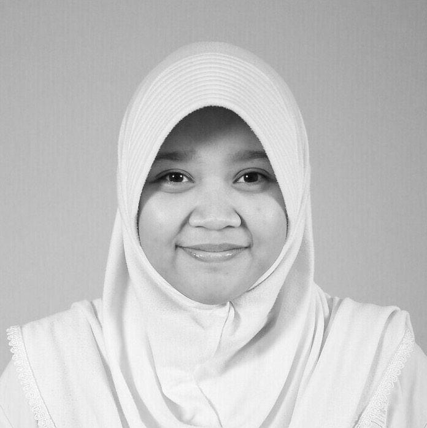

<!DOCTYPE html>
<html>
	<head>
		<meta charset = "utf-8"/>
		<tittle>CSS Inside HTML</tittle>
		

	</head>
	<body>
	

		<h1>CURRICULLUM VITAE</h1>
	

	<fieldset>
		<legend><strong><h2>Data Pribadi</h2></strong></legend>
	
	<table border = "2">
	<tbody>
		<tr>
			
			<td width = "300" bgcolor = "firebrick"><Strong>NAMA<Strong></td>
			<td bgcolor = "lightcoral">Axne Kartika Dewi Handayani</td>
			<td rowspan=8></td>

		</tr>
		<tr>
			<td width = "300" bgcolor = "firebrick"><Strong>NIM<Strong></td>
			<td bgcolor = "lightcoral">10161021</td>
		</tr>
		<tr>
			<td width = "300" bgcolor = "firebrick"><Strong>TEMPAT TANGGAL LAHIR<Strong></td>
			<td bgcolor = "lightcoral">Balikpapan, 21 April 1998</td>
		</tr>
		<tr>
			<td width = "300" bgcolor = "firebrick"><Strong>AGAMA<Strong></td>
			<td bgcolor = "lightcoral">Islam</td>
		</tr>
		<tr>
			<td width = "300" bgcolor = "firebrick"><Strong>ALAMAT<Strong></td>
			<td bgcolor = "lightcoral">JL Prona III RT 19 No 23 Sepinggan, Balikpapan Selatan</td>
		</tr>
	
	</tbody>
	</table>
	</fieldset>
	 

	

		

			<h2>Latar Belakang Pendidikan</h2>
	
				
Pada <strong>tahun 2002 sampai tahun 2004</strong>, saya  bersekolah di <strong>Taman Kanak-Kanak Ekadyasa</strong>, yang kebetulan berada  tidak jauh dari rumah. Selanjutnya, setelah lulus dari TK saya bersekolah <strong>SD N 025 Balikpapan Selatan pada tahun 2004 sampai 2010</strong>. Setelah lulus SD, dari <strong>tahun 2010 sampai 2013</strong> saya bersekolah di <strong>SMP Negeri 10 Balikpapan</strong>. Dan selanjutnya, saya meneruskan pendidikan saya di <strong>SMA Negeri 4 Balikpapan pada tahun 2013 sampai 2016</strong>. Dan terakhir, saya <strong>sedang menempuh pendidikan S1</strong> di salah satu universitas negeri di Balikpapan yaitu <strong>Institut Teknologi Kalimantan dari 2016 sampai dengan sekarang</strong>.

		

	 
		

			<h2>Kepanitiaan</h2>
				
				
Saya memiliki 2 kepanitiaan, yaitu menjadi <strong>panitia Kesehatana pada SPIn ITK 2017 dan panitia Kesehatan pada acara Dies Natalis ITK 2017.</strong>

		

		
	 
		

		

			<h2>Kontak</h2>
				
				
Saya memiliki kontak yang dapat dihubungi untuk yang memiliki kepentingan. Kontak saya yang dapat dihubungi yaitu <a href = "http://line.me/ti/p/~aneaxneee"><strong>Line</strong></a> dan <a href = "https://www.instagram.com/aneaxneee/"><strong>Instagram</strong></a>.

		

	</body>
</html>
